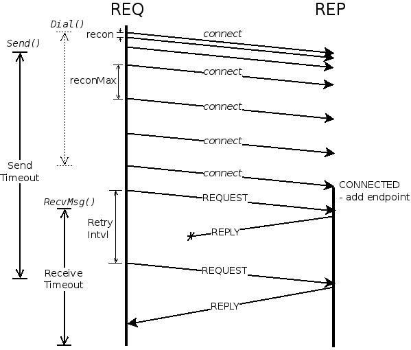

### Req/Rep Example

The files in this directory extend the basic reqreq example by various _commandline flags_
to set the internal socket options. Doing this is important to achieve the desired scalability protocol behaviour.

#### How To Build

Run `make`. Use `-h/--help` to see the various command-line options.

#### Basic Example

In one terminal, type
```bash
server> ./server -recv 30s
```

In another, type
```bash
client> ./client
```

and watch the message to see processing.


#### Detailed Example

The following diagram shows the various timings that influence the req/rep interaction:

 

The labels correspond to the following client/server _command-line options_:

 | Name in image   | Cient/server Option | Meaning                  |
 |-----------------|---------------------|--------------------------|
 | Receive Timeout | `-recv`     | Overall receive timeout          |
 | Send Timeout    | `-send`     | Send socket timeout              |
 | recon           | `-recon`    | Connection retry interval        |
 | reconMax        | `-reconMax` | Maximum retry interval (backoff) |
 | Retry Intvl     | `-retry`    | Retry interval (REQ client only) |
 | -               | `-rq`       | Read queue length                |
 | -               | `-wq`       | Write queue length               |

The rx/tx _queue length_ is important - for best results use values of 0 or 1.
